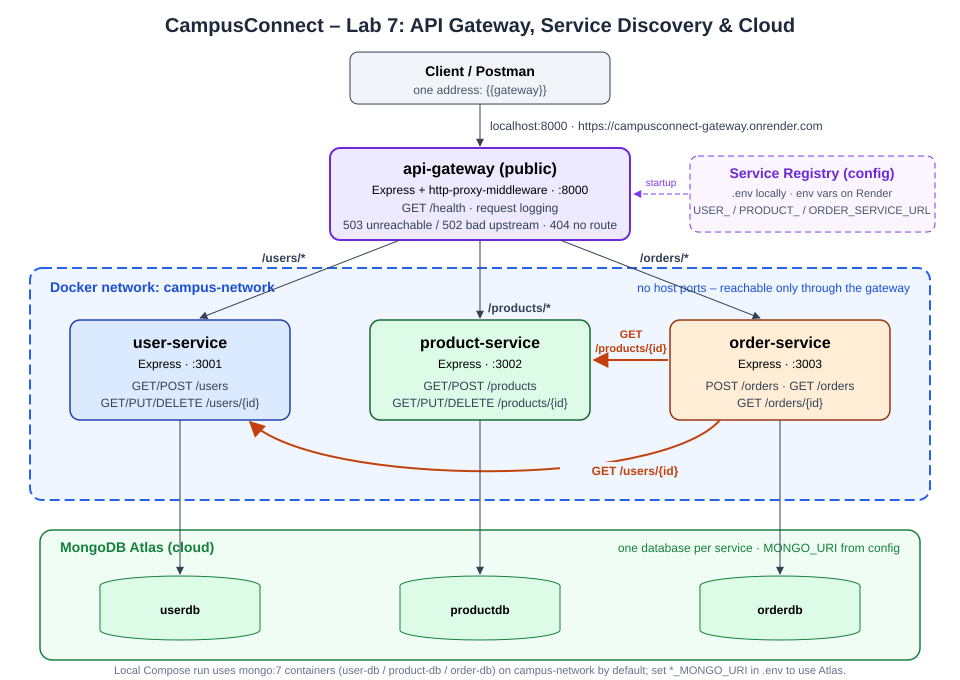

# Lab 7: API Gateway, Service Discovery & Cloud Deployment – CampusConnect

## Overview
Lab 6's three microservices (User, Product, Order) are copied here **unchanged** – same resources, endpoints and status codes. This lab adds:

1. **`api-gateway`** – a real single entry point (Express + `http-proxy-middleware`) with routing, `GET /health`, request logging and 502/503 error handling.
2. **Configuration-based service discovery** – the gateway builds its routing table from `USER_SERVICE_URL`, `PRODUCT_SERVICE_URL`, `ORDER_SERVICE_URL`; no URL is written in gateway code.
3. **Cloud deployment** – all four containers on **Render** (Docker runtime) with data in **MongoDB Atlas**.

Public gateway URL: **`https://campusconnect-gateway.onrender.com`** ← replace with the URL Render shows after deploying.

## Architecture


| Layer | Responsibility | Reachable from |
|---|---|---|
| Client / Postman | Sends every request to one address | Internet |
| API Gateway | Routes `/users`, `/products`, `/orders`; logging; error handling | Internet (only published port) |
| User / Product / Order | Own business logic and own data | Docker network only |
| MongoDB (Atlas in cloud) | Persistent storage, one database per service | Services via `MONGO_URI` |

## Project Structure
```
Lab-7/
├── api-gateway/          NEW  server.js, Dockerfile, package.json, .env.example
├── user-service/         unchanged from Lab 6
├── product-service/      unchanged from Lab 6
├── order-service/        unchanged from Lab 6
├── compose.yaml          gateway added; service ports removed
├── .env                  service registry (locations, ports, timeouts – no secrets)
├── render.yaml           Render Blueprint for the cloud deployment
├── architecture.svg
└── API-Gateway-Lab7.postman_collection.json
```

## Gateway Endpoints
| Gateway path | Routed to | Example |
|---|---|---|
| GET `/users`, `/users/{id}` | User Service | GET /users/101 |
| POST `/users`, PUT/DELETE `/users/{id}` | User Service | POST /users |
| GET `/products`, `/products/{id}` | Product Service | GET /products/501 |
| POST `/products`, PUT/DELETE `/products/{id}` | Product Service | POST /products |
| POST `/orders`, GET `/orders`, GET `/orders/{id}` | Order Service | POST /orders |
| GET `/health` | Gateway itself (not proxied) | `{"service":"api-gateway","status":"UP",...}` |
| anything else | Gateway itself | 404 `{"error":"No route for GET /x"}` |

The gateway forwards the path unchanged (`/users/101` → `http://user-service:3001/users/101`), so every response and status code is exactly what the service returns.

## Run Locally
```bash
docker compose up -d --build
docker compose ps          # only api-gateway shows a host port (0.0.0.0:8000->8000)
curl http://localhost:8000/health
docker compose logs -f api-gateway
```
Gateway port is `8000` (`GATEWAY_PORT` in `.env`; 8080 was already taken on the dev machine).

---

## Part A – API Gateway

**Routing.** `api-gateway/server.js` holds a registry of `{prefix, name, url}` and creates one proxy per entry. A request matches a service when its path is the prefix or starts with `prefix/`. The gateway has **no business logic** and does not parse bodies – it streams requests through.

**Health check.** `GET /health` → `200 {"service":"api-gateway","status":"UP","uptimeSeconds":4,"routes":{"/users":"user-service",...}}`. It only exposes route→service names, not internal URLs.

**Request logging** (method, path, target service, status, time):
```
[api-gateway] POST /orders -> order-service 201 155ms
[api-gateway] GET /orders/901 -> order-service 200 11ms
[api-gateway] product-service error: ENOTFOUND
[api-gateway] GET /products -> product-service 503 3619ms
```

**Centralized error handling.**
| Situation | Gateway response |
|---|---|
| Service stopped / DNS fails / connection refused (`ECONNREFUSED`, `ENOTFOUND`, `EAI_AGAIN`, `EHOSTUNREACH`) | **503** `{"error":"product-service is unavailable. Please try again later."}` |
| Connection reset or no answer within `PROXY_TIMEOUT_MS` | **502** `{"error":"Bad gateway: product-service failed to respond (ECONNRESET)"}` |
| Unknown path | **404** from the gateway |
| Service answers (any status) | passed through unchanged |

**Only the gateway is exposed.** In `compose.yaml` the three services and three databases have no `ports:`; only `api-gateway` publishes `8000:8000`. Verified:
```
localhost:3001 -> unreachable
localhost:3002 -> unreachable
localhost:3003 -> unreachable
localhost:8000/health -> 200
```

### Discussion: Why an API Gateway instead of direct client → service calls?
- **Single entry point** – clients know one URL instead of three hosts/ports; adding or splitting a service does not change the client.
- **Hides internal structure** – services, ports and databases stay on the private network; only the gateway is attack surface. Services can be moved, renamed or scaled without clients noticing.
- **Centralized cross-cutting concerns** – logging, error translation (clean 502/503 instead of hangs), and later auth, rate limiting, CORS and TLS are implemented once, not copied into every service.
- **Trade-off** – it is one more hop and a potential single point of failure, so in production it is replicated and kept free of business logic.

---

## Part B – Service Discovery (Configuration-Based)

**Registry.** Service locations live only in configuration:

| Variable | Local (`.env`) | Cloud (Render env vars) |
|---|---|---|
| `USER_SERVICE_URL` | `http://user-service:3001` | `https://campusconnect-user-service.onrender.com` |
| `PRODUCT_SERVICE_URL` | `http://product-service:3002` | `https://campusconnect-product-service.onrender.com` |
| `ORDER_SERVICE_URL` | `http://order-service:3003` | `https://campusconnect-order-service.onrender.com` |

The gateway reads them at startup, **refuses to start if one is missing** (no hidden hard-coded fallback), builds its routing table from them and prints it:
```
[api-gateway] /users/* -> user-service @ http://user-service:3001
[api-gateway] /products/* -> product-service @ http://product-service:3002
[api-gateway] /orders/* -> order-service @ http://order-service:3003
```
Order Service reads the same `USER_SERVICE_URL` / `PRODUCT_SERVICE_URL`, so one registry serves both callers.

**Proof – relocate User Service with configuration only.** Change in `.env` (or the shell):
```
USER_SERVICE_PORT=4001
USER_SERVICE_URL=http://user-service:4001
```
```bash
docker compose up -d        # recreates user-service, order-service, api-gateway – no rebuild, no code change
```
Result observed:
```
user-service  | [user-service] running on port 4001
api-gateway   | [api-gateway] /users/* -> user-service @ http://user-service:4001
GET  /users  via gateway                   [200]
POST /orders (order → user-service:4001)   [201]
```
Revert the two lines and `docker compose up -d` again.

### Static (config) vs dynamic service discovery
| | Static config (this lab) | Dynamic registry (Consul, Eureka, Kubernetes DNS/Services) |
|---|---|---|
| Where locations come from | `.env` / platform env vars, read once at startup | Services register themselves; clients query the registry at runtime |
| Location changes | Edit config + restart the gateway | Picked up automatically, no restart |
| Multiple instances | One URL per service | Many instances per service + client- or server-side load balancing |
| Health awareness | None – a dead URL stays in the table until someone edits it | Health checks remove failed instances from the pool |
| Scaling / auto-healing | Manual | New/replaced containers are discovered as they come up |
| Complexity | Very low – fine for a fixed set of services | Extra infrastructure to run and secure |

A dynamic registry adds what a static file cannot: **runtime registration, health-based removal, multiple instances with load balancing, and zero-restart updates**. Compose's and Render's DNS names already give a small taste of this (the name stays fixed while the container IP changes).

---

## Part C – Cloud Deployment (Render + MongoDB Atlas)

**Platform:** Render, free plan, Docker runtime, defined as code in `render.yaml` (Blueprint). **Database:** MongoDB Atlas (already used since Lab 4).

### 1. MongoDB Atlas
1. Atlas → your cluster → **Database Access**: user with read/write.
2. **Network Access** → add `0.0.0.0/0` (Render free services have no static outbound IP).
3. Copy the connection string three times, changing only the database name – one database per service:
   ```
   mongodb+srv://<user>:<pass>@<cluster>.mongodb.net/userdb?retryWrites=true&w=majority
   mongodb+srv://<user>:<pass>@<cluster>.mongodb.net/productdb?retryWrites=true&w=majority
   mongodb+srv://<user>:<pass>@<cluster>.mongodb.net/orderdb?retryWrites=true&w=majority
   ```

### 2. Push to GitHub
Push the **contents of `Lab-7/`** as the root of a GitHub repo (`render.yaml` must be at the repo root).
```bash
cd Lab-7
git init && git add . && git commit -m "Lab 7: API gateway + Render blueprint"
git branch -M main && git remote add origin https://github.com/<you>/campusconnect-lab7.git && git push -u origin main
```

### 3. Deploy the Blueprint
Render Dashboard → **New → Blueprint** → select the repo. Render reads `render.yaml` and creates four Docker web services. Because every location/secret is `sync: false`, it asks for the values:

| Service | Variable | Value |
|---|---|---|
| campusconnect-user-service | `MONGO_URI` | Atlas …/`userdb` |
| campusconnect-product-service | `MONGO_URI` | Atlas …/`productdb` |
| campusconnect-order-service | `MONGO_URI` | Atlas …/`orderdb` |
| campusconnect-order-service | `USER_SERVICE_URL` / `PRODUCT_SERVICE_URL` | the user / product service public URLs |
| campusconnect-gateway | `USER_SERVICE_URL` / `PRODUCT_SERVICE_URL` / `ORDER_SERVICE_URL` | the three service public URLs |

Service URLs follow `https://<service-name>.onrender.com`. If Render added a suffix because a name was taken, copy the real URL from each service page, fix it under **Environment**, and **Save, rebuild and deploy** the gateway / order service. `PROXY_TIMEOUT_MS=90000` and `REQUEST_TIMEOUT_MS=60000` are set in `render.yaml` so a sleeping free service has time to wake up.

### 4. Verify
```bash
curl https://campusconnect-gateway.onrender.com/health
```
Then in Postman set the collection variable `gateway` to the public URL and run folders **0–3**. The first request after idle can take ~1 minute (cold start); later ones are fast.

### What was deployed & limitations
- **Deployed:** gateway + all three services (4 Docker containers) + Atlas – the full chain gateway → services → MongoDB Atlas.
- **Internal services are public on Render free.** Render's free web services *cannot receive private-network traffic* and private services (`type: pserv`) are paid-only, so the gateway and order-service call the services over their public `onrender.com` URLs. Locally the Docker network boundary is enforced; in the cloud it is not. On a paid plan: change the three services to `type: pserv` and set the URLs with `fromService: { name: ..., property: hostport }` – a config change only, gateway code unchanged.
- **Cold starts:** free services sleep after 15 min idle and take ~1 min to wake.
- **Free hours:** 750 instance-hours/month shared by all free services in the workspace.

### Unreachable-service test in the cloud
Set the gateway's `PRODUCT_SERVICE_URL` to a host that does not exist (e.g. `https://campusconnect-missing.invalid`), save & deploy, run *4. Unreachable Service → DOWN (503)*, then restore the real URL and run *After Restart (200)*. (Alternatively suspend the product service from its Settings page.)

---

## Postman
Import `API-Gateway-Lab7.postman_collection.json` ("API Gateway – Lab 7"). One variable, `gateway` (default `http://localhost:8000`) – every request goes through the gateway.

| Folder | Tests |
|---|---|
| 0. Gateway | `GET /health` 200 + `status: UP`; unknown route 404 |
| 1. /users → User Service | create 201, list/get/update 200, invalid 404 |
| 2. /products → Product Service | create 201, list/get/update 200, invalid 404 |
| 3. /orders → Order Service | create 201 (Order→User/Product), list/get 200, invalid user/product 404 |
| 4. Unreachable Service | run `docker compose stop product-service` → 503; `docker compose start product-service` → 200 |

Local result (Newman, folders 0–3): **17 requests, 20 assertions, 0 failures.** Folder 4: stopped product-service → `503 {"error":"product-service is unavailable. Please try again later."}`, restarted → `200`.

CLI equivalent: `npx newman run API-Gateway-Lab7.postman_collection.json --env-var gateway=https://<your-gateway>.onrender.com --folder "0. Gateway" --folder "1. /users → User Service" --folder "2. /products → Product Service" --folder "3. /orders → Order Service (Order → User / Product)"`

### Evidence to capture
- [ ] Postman: folders 0–3 against `http://localhost:8000`
- [ ] Postman: folder 4 (503 while stopped, 200 after restart) + `docker compose logs api-gateway`
- [ ] `docker compose ps` showing only the gateway port published
- [ ] Config-change proof: `.env` diff + gateway startup log with the new URL
- [ ] Render dashboard: four services "Live", gateway Environment tab, deploy logs
- [ ] Postman: folders 0–3 against the public gateway URL

## Troubleshooting
| Issue | Fix |
|---|---|
| Gateway exits: `Missing service URL config for: ...` | a `*_SERVICE_URL` is not set in `.env` / Render Environment |
| `503 ... is unavailable` | target container stopped or wrong host in the URL (`ENOTFOUND`) – check `docker compose ps` / the URL |
| `502 Bad gateway ... ECONNRESET` | service crashed mid-request or exceeded `PROXY_TIMEOUT_MS` – check that service's logs |
| `localhost:3001` no longer works | intended – services are internal; use `localhost:8000/users` |
| `port is already allocated` on 8000 | change `GATEWAY_PORT` in `.env` |
| POST body empty at the service | don't add `express.json()` to the gateway – it would consume the body before proxying |
| Render: first request very slow / times out | cold start – wait ~1 min and retry |
| Render: `MongoServerSelectionError` | Atlas Network Access missing `0.0.0.0/0`, or wrong password in `MONGO_URI` |
| Render: gateway 404 HTML from `onrender.com` | wrong service URL (Render added a suffix) – copy the real one into Environment |
| stale code locally | `docker compose up -d --build` |

## Reflection
In Lab 6 a client had to know three ports and talk to each service directly, so the internal layout leaked straight into Postman and any frontend. The gateway collapses that into one address: clients now see `/users`, `/products` and `/orders` and nothing about where those live. Operationally, logging and failure handling moved to one place – one log shows every request with its target and status, and a dead service now yields an immediate, readable 503 instead of a connection error at the client. Moving service locations into configuration meant the same code runs unmodified on Docker Compose and on Render; only environment variables differ, which I proved by moving User Service to another port without touching code. Deploying to the cloud turned "works on my machine" into a system anyone can call over the internet, but it also surfaced real-world concerns Lab 6 never had: cold starts, timeouts sized for sleeping services, free-tier networking limits, and managing secrets through a dashboard instead of a local file.
