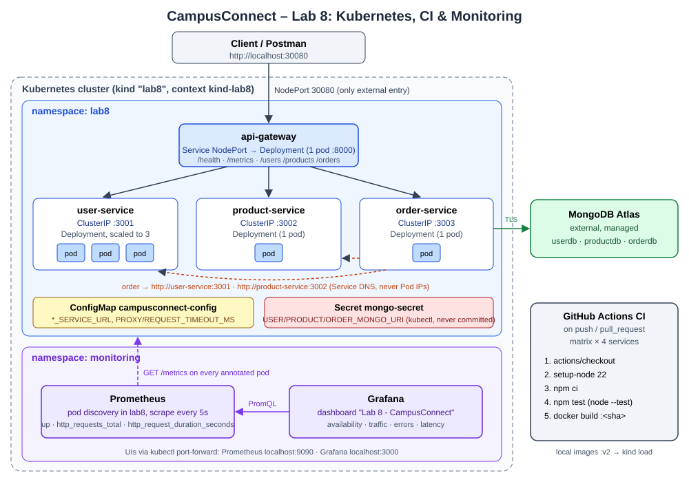

# Lab 8: Kubernetes, Basic CI/CD & Monitoring – CampusConnect

## Overview
Lab 7's application (API Gateway + User / Product / Order services, MongoDB Atlas) is copied here and moved onto a DevOps workflow:

1. **Kubernetes** – all four services run as Deployments + Services in namespace `lab8`; configuration in a ConfigMap, Atlas URIs in a Secret; scaling and self-healing demonstrated.
2. **GitHub Actions CI** – on every push / pull request each service is checked out, installed (`npm ci`), tested (`npm test`) and built into a Docker image.
3. **Prometheus + Grafana** – every service exposes `/metrics`; Prometheus discovers the pods and Grafana shows availability, traffic, errors and latency.

### Changes to the Lab 7 code (the only ones)
| Change | Why |
|---|---|
| `prom-client` + a small middleware and `GET /metrics` in each `server.js` | Prometheus needs metrics to scrape: `http_requests_total`, `http_request_duration_seconds`, plus Node process defaults |
| `test/server.test.js` + `"test": "node --test"` in each service | CI needs tests. They start the real server with no database and check health, validation, 404s, gateway 503 handling and `/metrics` |
| `package-lock.json` for every service | `npm ci` in CI needs a lockfile |
| "Connected to MongoDB" log prints the database name, not the URI | the URI contains Atlas credentials and would leak into `kubectl logs` |
| `.env` added to `.gitignore` | never commit credentials |

Business logic, routes and status codes are unchanged. The Lab 7 `compose.yaml` and `render.yaml` still work.

## Architecture


```
Client / Postman ──► localhost:30080 (NodePort) ──► api-gateway Service ──► api-gateway Pod
                                                         │  http://user-service:3001 / product-service:3002 / order-service:3003
                                                         ▼
                                    user-service (×3) · product-service · order-service  ──►  MongoDB Atlas
Prometheus (namespace monitoring) ── scrapes /metrics of every pod in lab8 ──► Grafana dashboard
```

## Project Structure
```
Lab-8/
├── api-gateway/ user-service/ product-service/ order-service/   (+ /metrics, + test/)
├── k8s/
│   ├── configmap.yaml
│   ├── gateway-deployment.yaml   gateway-service.yaml     (NodePort 30080)
│   ├── user-deployment.yaml      user-service.yaml        (ClusterIP 3001)
│   ├── product-deployment.yaml   product-service.yaml     (ClusterIP 3002)
│   ├── order-deployment.yaml     order-service.yaml       (ClusterIP 3003)
│   └── monitoring/
│       ├── prometheus.yaml       namespace, RBAC, config, Deployment, Service
│       └── grafana.yaml          data source + dashboard provisioning, Deployment, Service
├── (CI workflow: ../.github/workflows/ci.yml at the repository root)
├── kind-config.yaml              local cluster definition (maps NodePort 30080 → localhost)
├── compose.yaml / render.yaml    Lab 7 (unchanged)
└── API-Gateway-Lab7.postman_collection.json
```

## Prerequisites & Kubernetes environment
| Tool | Version used |
|---|---|
| Docker Desktop | 29.6.1 |
| kind (Kubernetes in Docker) | v0.30.0 → Kubernetes v1.34.0, 1 control-plane node |
| kubectl | v1.36.1 |
| Node.js | 22 |

**Selected environment: kind**, a single-node local cluster running inside Docker. `kind-config.yaml` maps the gateway's NodePort `30080` to `localhost:30080`, so Postman reaches the gateway without port-forwarding.

## 1. Cluster & context
```bash
kind create cluster --config kind-config.yaml     # creates cluster "lab8", context "kind-lab8"
kubectl config current-context                    # kind-lab8
kubectl get nodes                                 # lab8-control-plane   Ready   control-plane
kubectl create namespace lab8
kubectl config set-context --current --namespace=lab8   # optional: make lab8 the default
```

## 2. Images
Images use **versioned tags** (`:v2` = Lab 7 code + metrics). kind nodes cannot see the host's Docker images, so they are loaded into the node. `imagePullPolicy: IfNotPresent` makes Kubernetes use the loaded images.
```bash
for s in api-gateway user-service product-service order-service; do
  docker build -t $s:v2 ./$s
  kind load docker-image $s:v2 --name lab8
done
```

## 3. Configuration
| Object | Name | Keys | Used by |
|---|---|---|---|
| ConfigMap | `campusconnect-config` | `USER_SERVICE_URL`, `PRODUCT_SERVICE_URL`, `ORDER_SERVICE_URL`, `PROXY_TIMEOUT_MS`, `REQUEST_TIMEOUT_MS` | gateway, order-service (`envFrom`) |
| Secret | `mongo-secret` | `USER_MONGO_URI`, `PRODUCT_MONGO_URI`, `ORDER_MONGO_URI` | user / product / order (`secretKeyRef` → `MONGO_URI`) |
| Deployment env | – | `PORT` | each container |

Service URLs are **Kubernetes Service names** (`http://user-service:3001`), resolved by cluster DNS, so they stay valid when Pods are replaced or scaled. Pod IPs are never used.

The Secret is **not in the repository**. Create it from your Atlas connection strings:
```bash
kubectl create secret generic mongo-secret -n lab8 \
  --from-literal=USER_MONGO_URI='mongodb+srv://<user>:<pass>@<cluster>/userdb?retryWrites=true&w=majority' \
  --from-literal=PRODUCT_MONGO_URI='mongodb+srv://<user>:<pass>@<cluster>/productdb?retryWrites=true&w=majority' \
  --from-literal=ORDER_MONGO_URI='mongodb+srv://<user>:<pass>@<cluster>/orderdb?retryWrites=true&w=majority'
```
Atlas → Network Access must allow your public IP (or `0.0.0.0/0`), because the kind node reaches Atlas through your machine's internet connection.

To change the Secret later: delete it, create it again, then run `kubectl rollout restart deployment -n lab8`.

## 4. Deploy & verify
```bash
kubectl apply -f k8s/ -n lab8
kubectl get deployments -n lab8
kubectl get pods -n lab8 -o wide
kubectl get services -n lab8
kubectl get endpoints -n lab8
```
<!-- RESULTS:DEPLOY -->

## 5. Access & test the gateway
The gateway is the **only** externally exposed Service (`type: NodePort`, `nodePort: 30080`); the three services are `ClusterIP` and can only be reached inside the cluster.
```bash
curl http://localhost:30080/health
curl http://localhost:30080/users
```
**Postman:** import `API-Gateway-Lab7.postman_collection.json` and set the collection variable `gateway` to `http://localhost:30080`. Run folders 0–3.

CLI equivalent:
```bash
npx newman run API-Gateway-Lab7.postman_collection.json --env-var gateway=http://localhost:30080 \
  --folder "0. Gateway" --folder "1. /users → User Service" --folder "2. /products → Product Service" \
  --folder "3. /orders → Order Service (Order → User / Product)"
```
<!-- RESULTS:GATEWAY -->

## 6. Scaling
```bash
kubectl scale deployment user-service --replicas=3 -n lab8
kubectl get pods -n lab8 -l app=user-service -o wide
kubectl get endpoints user-service -n lab8      # 3 pod IPs behind one stable Service
```
<!-- RESULTS:SCALE -->

## 7. Self-healing
```bash
kubectl get pods -n lab8 -l app=user-service
kubectl delete pod <user-service-pod-name> -n lab8
kubectl get pods -n lab8 -l app=user-service -w     # a replacement is created at once
```
<!-- RESULTS:HEAL -->

## 8. GitHub Actions CI
`.github/workflows/ci.yml` at the **repository root** (GitHub only runs workflows from there). It runs only when `Lab-8/**` or the workflow changes, and each job works in `Lab-8/<service>`:

| Setting | Value |
|---|---|
| Triggers | `push`, `pull_request` |
| Runner | `ubuntu-latest` |
| Matrix | `api-gateway`, `user-service`, `product-service`, `order-service` (one job each, `fail-fast: false`) |
| Steps | `actions/checkout@v4` → `actions/setup-node@v4` (Node 22, npm cache) → `npm ci` → `npm test` → `docker build -t <service>:<commit-sha> .` |

The tests need no database or network: each one starts the real `server.js` with the backends pointed at a closed port, then checks the routes that do not touch MongoDB (4 tests per service, 16 in total). Run them locally with `npm test` inside any service folder.

To show a second CI run, make a small change (for example, edit this README), commit it and push. A new run appears under **Actions**.

## 9. Prometheus
```bash
kubectl apply -f k8s/monitoring/
kubectl port-forward -n monitoring svc/prometheus 9090:9090     # http://localhost:9090
```
**Targets.** Prometheus uses Kubernetes pod discovery (`role: pod`, namespace `lab8`) and keeps only Pods annotated `prometheus.io/scrape: "true"`. All four Deployments carry that annotation. It adds the labels `service` (from the pod's `app` label) and `pod`. The scrape interval is 5 s. Its ServiceAccount can only `get/list/watch` Pods in `lab8` (a Role, not cluster-wide).
Status → Targets shows job `campusconnect` with one target per pod (6 after scaling: gateway, 3× user, product, order).

**Metrics exposed by every service**
| Metric | Type | Labels | Question |
|---|---|---|---|
| `up` | (Prometheus) | `service`, `pod` | Is the target reachable? |
| `http_requests_total` | counter | `method`, `status` (+ `target` on the gateway) | How much traffic? How many errors? |
| `http_request_duration_seconds` | histogram | same | How long do requests take? |
| `process_*`, `nodejs_*` | defaults | – | CPU, memory, event-loop lag |

**Useful queries**
```promql
up
sum by (service) (up)
rate(http_requests_total[5m])
sum by (target) (rate(http_requests_total{service="api-gateway"}[1m]))
sum by (target, status) (rate(http_requests_total{service="api-gateway", status=~"4..|5.."}[1m]))
histogram_quantile(0.95, sum by (le, target) (rate(http_request_duration_seconds_bucket{service="api-gateway"}[1m])))
sum by (pod) (rate(http_requests_total{service="user-service"}[1m]))
```
<!-- RESULTS:PROM -->

## 10. Grafana
```bash
kubectl port-forward -n monitoring svc/grafana 3000:3000        # http://localhost:3000
```
The Prometheus data source and the dashboard **"Lab 8 - CampusConnect"** are provisioned from ConfigMaps, so nothing has to be clicked together. The dashboard is also Grafana's home page. Anonymous visitors get read-only access; to edit, log in as `admin` (Grafana's default password, which you must change on first login – no password is stored in the repo).

| Panel | Monitoring question | PromQL |
|---|---|---|
| Pods UP per service (stat) | Are targets reachable? | `sum by (service) (up{job="campusconnect"})` |
| Gateway req/s by target | How much traffic is arriving? | `sum by (target) (rate(http_requests_total{service="api-gateway"}[1m]))` |
| Gateway 4xx/5xx req/s | Are failures increasing? | `sum by (target, status) (rate(http_requests_total{service="api-gateway",status=~"4..\|5.."}[1m]))` |
| Gateway p95 latency | How long are requests taking? | `histogram_quantile(0.95, sum by (le, target) (rate(http_request_duration_seconds_bucket{service="api-gateway"}[1m])))` |
| User Service req/s per pod | Is load spread across the 3 replicas? | `sum by (pod) (rate(http_requests_total{service="user-service"}[1m]))` |

## 11. Generate traffic & observe
```bash
# normal traffic: 200 requests through the gateway
for i in $(seq 1 50); do for p in users products orders health; do curl -s -o /dev/null localhost:30080/$p; done; done
# controlled failure experiment: 404s from invalid IDs and unknown routes, then a 503 from a stopped service
for i in $(seq 1 30); do curl -s -o /dev/null localhost:30080/users/99999; curl -s -o /dev/null localhost:30080/nope; done
kubectl scale deployment product-service --replicas=0 -n lab8
for i in $(seq 1 20); do curl -s -o /dev/null localhost:30080/products; done      # 503 product-service is unavailable
kubectl scale deployment product-service --replicas=1 -n lab8
```
Running the Postman collection with Newman's `-n 10` flag also generates steady traffic.
<!-- RESULTS:TRAFFIC -->

## 12. Troubleshooting
```bash
kubectl describe pod <pod> -n lab8        # events: image pull, probe failures, missing Secret/ConfigMap
kubectl logs <pod> -n lab8                # application log (gateway logs every request with its target)
kubectl logs deploy/api-gateway -n lab8 -f
kubectl get endpoints -n lab8             # empty endpoints = selector mismatch or pods not Ready
kubectl get events -n lab8 --sort-by=.lastTimestamp
```
| Symptom | Cause / fix |
|---|---|
| `ErrImagePull` / `ImagePullBackOff` for `*:v2` | image not loaded into kind → `kind load docker-image <svc>:v2 --name lab8` |
| `CreateContainerConfigError` | `mongo-secret` missing or a key misspelled → create the Secret (section 3) |
| Pod `Running` but `0/1 READY` | readiness probe failing → `kubectl describe pod` for the probe error, `kubectl logs` for the app error |
| Gateway 503 `... is unavailable` | target Service has no ready endpoints → `kubectl get endpoints` |
| Gateway 502 / requests hang with Atlas | Atlas Network Access does not allow your IP, or wrong password → check the service log for `MongoDB connection error` |
| `localhost:30080` refused | cluster was not created with `kind-config.yaml` (no port mapping) → `kubectl port-forward svc/api-gateway 8000:8000 -n lab8` instead |
| Prometheus target list empty | pods lack the `prometheus.io/scrape` annotation, or `k8s/monitoring/` was applied before `lab8` existed (the Role lives in `lab8`) → re-apply |
<!-- RESULTS:TROUBLE -->

## Evidence checklist
| # | Evidence | How |
|---|---|---|
| 1 | Lab 7 baseline | Postman against `http://localhost:8000` (`docker compose up -d` in Lab-7) |
| 2 | Kubernetes environment | `kubectl config current-context`, `kubectl get nodes` |
| 3 | Manifests | files in `k8s/` |
| 4 | Deployment | `kubectl get deployments,pods,services -n lab8` |
| 5 | Gateway test | Postman against `http://localhost:30080` |
| 6 | Scaling | `kubectl get pods -l app=user-service` after scaling to 3 |
| 7 | Self-healing | `kubectl delete pod` + `kubectl get pods -w` |
| 8 | Troubleshooting | `kubectl describe` / `logs` / `get endpoints` |
| 9 | GitHub Actions | Actions tab → successful `CI` run (4 green matrix jobs) |
| 10 | Prometheus | Status → Targets (all UP) + a query graph |
| 11 | Grafana | "Lab 8 - CampusConnect" dashboard |
| 12 | Traffic | dashboard after running section 11 |
| 13 | Architecture | `architecture.svg` |

## Cleanup
```bash
kind delete cluster --name lab8
```
